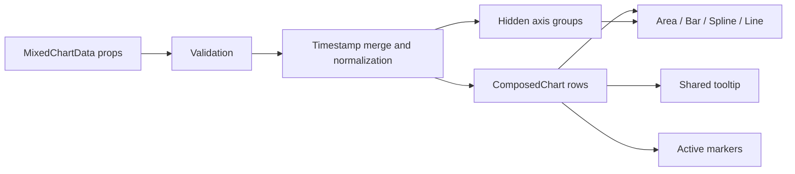

# Архитектура смешанного time-series графика

## 1. Контекст и границы задачи

Нужно создать автономное frontend-приложение с переиспользуемым графиком, который принимает четыре временных ряда и одновременно отображает их как:

1. `area`;
2. `spline`;
3. `line`;
4. `bar`.

Источником визуального поведения служит [CleanShot GIF](https://cleanshot.com/share/cBDRxJWM). В анализируемом GIF — 119 кадров размером 800×529 и продолжительностью около 10,5 секунды. Область задачи — сам график, его tooltip, адаптивность и публичный способ инициализации. Окружающий интерфейс из референса (таблица `Tdy`, кнопка редактирования и остальной конструктор) не входит в реализацию.

Это статическое клиентское приложение. Backend, база данных, авторизация и получение данных по сети не требуются.

## 2. Наблюдаемое поведение референса

### Визуальная модель

- оси, подписи делений, сетка и легенда скрыты;
- plot area ограничена тонкой серой прямоугольной рамкой;
- `area` — светло-жёлтая полупрозрачная область с плавной верхней границей;
- `spline` — толстая зелёная плавная линия без постоянно видимых маркеров;
- `line` — тонкая фиолетовая ломаная с квадратными маркерами;
- `bar` — узкие синие столбцы от нулевой линии;
- порядок наложения: `area` → `bar` → `spline` → `line`;
- у графика нет собственного непрозрачного фона: фон задаёт родитель/demo-page;
- сверху у всех шкал есть запас, поэтому максимальная точка не касается рамки.

### Масштабирование

Ряды имеют разные единицы измерения и не должны автоматически попадать на одну общую Y-шкалу:

- `Cost` (`area`) и `CPA` (`bar`) разделяют группу шкалы `money`;
- `ROI confirmed` (`spline`) использует отдельную группу `roi`;
- `Conversions` (`line`) использует отдельную группу `conversions`.

Именно общая шкала `money` объясняет небольшую высоту столбцов CPA относительно Cost. Каждая скрытая шкала начинается с нуля и получает около 20% запаса сверху. Для группы, где максимум равен нулю, используется безопасный домен `[0, 1]`.

### Интеракция

- наведение выбирает ближайшую X-координату и показывает один общий tooltip по всем доступным рядам;
- tooltip содержит дату в формате `DD.MM.YYYY`, затем значения в порядке `area`, `bar`, `spline`, `line`;
- строка ряда состоит из цветного круглого маркера, label и выделенного полужирным значения;
- tooltip следует за активной точкой, но не выходит за границы plot area;
- активные точки получают полупрозрачный цветной halo; постоянный квадратный маркер `line` сохраняется;
- после ухода указателя из графика tooltip и активные halo исчезают;
- вертикальная crosshair-линия не отображается.

## 3. Архитектурные решения

### 3.1. Стек

- React + TypeScript;
- Vite для локальной разработки и production-сборки;
- Recharts для SVG-графика;
- SCSS Modules для локальных стилей;
- Vitest + React Testing Library для unit/component тестов;
- Playwright для браузерных и визуальных проверок;
- ESLint и Prettier для статических проверок и форматирования.

Версии фиксируются lock-файлом при создании приложения; перед установкой используются актуальные совместимые стабильные версии, а не версии из старого проекта.

Recharts выбран потому, что `ComposedChart` штатно объединяет `Area`, `Line` и `Bar`, поддерживает отдельные Y-оси, общий настраиваемый tooltip, active markers и адаптивный SVG. Это покрывается официальной документацией: [ComposedChart](https://recharts.github.io/api/ComposedChart/), [Tooltip](https://recharts.github.io/en-US/api/Tooltip/), [ResponsiveContainer](https://recharts.github.io/api/ResponsiveContainer/). D3 дал бы больше низкоуровневого контроля, но добавил бы лишний объём кода для уже поддерживаемого сценария; canvas-библиотеки усложнили бы DOM-проверки и точную стилизацию tooltip/маркеров.

### 3.2. Структура проекта

Для небольшого приложения используется пропорциональный поднабор FSD без пустых слоёв:

```text
src/
├── app/
│   ├── App.tsx
│   └── styles/
│       └── index.scss
├── pages/
│   └── chart-demo/
│       └── ui/
│           ├── ChartDemoPage.tsx
│           └── ChartDemoPage.module.scss
└── shared/
    └── ui/
        └── mixed-time-series-chart/
            ├── index.ts
            ├── lib/
            │   ├── format-date.ts
            │   ├── format-value.ts
            │   └── normalize-data.ts
            ├── model/
            │   └── types.ts
            └── ui/
                ├── ActiveMarker.tsx
                ├── ChartTooltip.tsx
                ├── MixedTimeSeriesChart.tsx
                ├── PlotFrame.tsx
                └── MixedTimeSeriesChart.module.scss
e2e/
├── mixed-chart.spec.ts
└── mixed-chart.visual.spec.ts
```

`features`, `entities` и `widgets` не создаются: в текущей задаче у них нет самостоятельной ответственности. Публичный импорт компонента и его типов разрешён только через `shared/ui/mixed-time-series-chart/index.ts`.

### 3.3. Публичный контракт

```ts
export interface TimePoint {
  /** ISO 8601 date or datetime. */
  timestamp: string;
  value: number | null;
}

export interface TimeSeries {
  label: string;
  points: readonly TimePoint[];
  /** Series with the same axisGroup share one hidden Y scale. */
  axisGroup: string;
  minimumFractionDigits?: number;
  maximumFractionDigits?: number;
}

export interface MixedChartData {
  area: TimeSeries;
  spline: TimeSeries;
  line: TimeSeries;
  bar: TimeSeries;
}

export interface MixedTimeSeriesChartProps {
  data: MixedChartData;
  locale?: string;
  height?: number;
  ariaLabel?: string;
  emptyMessage?: string;
  className?: string;
}
```

`MixedChartData` объектом, а не массивом, гарантирует наличие ровно четырёх ролей и не связывает корректность с порядком элементов. Настройки цвета и геометрии намеренно не являются публичными props в первой версии: это часть заданного дизайна. `axisGroup` остаётся входным параметром, потому что принадлежность метрик к общей шкале — свойство данных, а не вида линии.

Рекомендуемая инициализация для референса:

```tsx
const data: MixedChartData = {
  area: {
    label: 'Cost',
    axisGroup: 'money',
    minimumFractionDigits: 2,
    maximumFractionDigits: 2,
    points: cost,
  },
  spline: {
    label: 'ROI confirmed',
    axisGroup: 'roi',
    minimumFractionDigits: 2,
    maximumFractionDigits: 2,
    points: roi,
  },
  line: {
    label: 'Conversions',
    axisGroup: 'conversions',
    maximumFractionDigits: 0,
    points: conversions,
  },
  bar: {
    label: 'CPA',
    axisGroup: 'money',
    minimumFractionDigits: 2,
    maximumFractionDigits: 2,
    points: cpa,
  },
};

<MixedTimeSeriesChart
  data={data}
  locale="ru-RU"
  height={320}
  ariaLabel="Campaign metrics by date"
/>
```

### 3.4. Валидация и нормализация данных

Каждый ряд приходит независимо. `normalize-data.ts`:

1. проверяет ISO 8601 timestamp, конечное неотрицательное значение или `null`, уникальность timestamp внутри ряда и непустые `label`/`axisGroup`;
2. строит объединение всех timestamp и сортирует их по времени по возрастанию;
3. формирует строки Recharts вида `{ timestamp, area, spline, line, bar }`;
4. оставляет отсутствующие значения как `null`, не соединяя линию через разрыв;
5. вычисляет скрытые оси и домен отдельно для каждого `axisGroup`.

Некорректная конфигурация — ошибка разработчика: нормализатор выбрасывает типизированную ошибку с ролью ряда и индексом точки. Если все четыре ряда пусты, компонент показывает доступное empty-state сообщение вместо пустого SVG. Частично пустые ряды допустимы.

Для предсказуемой работы с часовыми поясами принимаются либо календарные даты `YYYY-MM-DD`, либо datetime с обязательным `Z`/UTC offset. Date-only значения форматируются как UTC-календарные даты и не могут сдвинуться на предыдущий день в часовом поясе пользователя.



Нормализованные данные вычисляются через `useMemo`; они не копируются в React state. Компонент не выполняет сетевых запросов и не имеет побочных эффектов, кроме наблюдения за размером контейнера средствами Recharts/ResizeObserver.

## 4. Рендеринг и дизайн-токены

### 4.1. Отображение серий

| Роль | Recharts primitive | Интерполяция | Основной стиль |
|---|---|---|---|
| `area` | `Area` | `monotoneX` | прозрачный/тонкий контур, жёлтая заливка |
| `spline` | `Line` | `natural` | зелёный stroke 4 px, без обычных dots |
| `line` | `Line` | `linear` | фиолетовый stroke 2 px, квадратные dots |
| `bar` | `Bar` | — | синий fill, ширина около 32 px с responsive cap |

Каждая primitive получает `yAxisId`, равный `axisGroup`. Оси рендерятся скрытыми. Plot frame рисуется отдельным SVG-компонентом `PlotFrame`, чтобы рамка совпадала именно с вычисленной областью построения, а не с внешним контейнером.

### 4.2. Начальные токены для visual calibration

| Токен | Начальное значение |
|---|---|
| plot frame | `#a9adaf`, 1 px |
| area fill | `#fff0a6`, opacity `0.78` |
| spline | `#078b0b`, 5 px |
| line | `#aa00f5`, 2 px |
| line square | 12×12 px |
| bar | `#2b72f6`, max width 36 px |
| tooltip background | `#ffffff` |
| tooltip border | `#8f8f8f`, 1 px |
| tooltip radius | 4 px |
| tooltip shadow | `0 2px 7px rgb(0 0 0 / 35%)` |
| tooltip typeface | Arial-compatible sans-serif, 20–23 px |
| active halo | series color, radius 20 px, opacity `0.20` |

Это стартовые значения, полученные из GIF. Финальные цвета, толщины, отступы и радиусы уточняются по Playwright-скриншотам на фиксированном viewport; они хранятся как CSS custom properties внутри SCSS Module, чтобы избежать разбросанных magic numbers.

## 5. Tooltip, доступность и responsive

- `ChartTooltip` — HTML-элемент, получающий normalized payload от Recharts и сортирующий строки в фиксированном порядке `area`, `bar`, `spline`, `line`.
- Дата форматируется через `Intl.DateTimeFormat`; значения — через `Intl.NumberFormat`, без внешней date/number-библиотеки.
- Позиционирование использует координаты Recharts и `allowEscapeViewBox={false}`; крайние даты проверяются отдельно, чтобы tooltip не обрезался.
- График заполняет ширину родителя, высота задаётся prop `height` (по умолчанию 320 px). Минимальная поддерживаемая ширина — 320 px.
- На узкой ширине уменьшаются внутренние отступы и ширина bar, но порядок слоёв и tooltip сохраняются.
- Включается accessibility layer Recharts; контейнер получает понятный `aria-label`. Tooltip должен быть достижим при клавиатурной навигации по точкам. Декоративные SVG-элементы исключаются из accessibility tree.
- Анимация появления короткая и отключается при `prefers-reduced-motion: reduce`. Тесты не зависят от промежуточных кадров анимации.

## 6. Demo-page и документация

Demo-page использует пять дат и значения из референса:

| Date | Cost | CPA | ROI confirmed | Conversions |
|---|---:|---:|---:|---:|
| 10.06.2026 | 2.04 | 0.68 | 610.78 | 3 |
| 11.06.2026 | 25.85 | 0.86 | 180.50 | 30 |
| 12.06.2026 | 44.36 | 1.23 | 161.47 | 36 |
| 13.06.2026 | 55.65 | 0.79 | 56.33 | 70 |
| 14.06.2026 | 63.75 | 0.71 | 357.25 | 90 |

README должен содержать требования к Node.js, команды установки/запуска/проверок/сборки, полный пример четырёх массивов и импорт из публичного `index.ts`. Production-результат — статическая папка `dist/`.

## 7. Стратегия тестирования

### Unit

- объединение и хронологическая сортировка timestamp;
- группировка шкал и расчёт доменов;
- `null` и несовпадающие timestamp;
- отклонение duplicate/invalid/non-finite/negative data;
- формат даты и дробной части для заданной locale;
- фиксированный порядок tooltip rows.

### Component

- четыре типа серий и нужное число скрытых осей;
- empty state и частично пустые данные;
- labels и accessible name;
- custom markers и CSS classes/tokens;
- отсутствие легенды, grid и видимых подписей осей.

### Playwright

- hover первой, средней и последней даты;
- точные дата, порядок и значения tooltip;
- исчезновение tooltip при mouse leave;
- отсутствие обрезания tooltip у левого/правого края;
- responsive viewport 320 px и эталонный desktop viewport 800×529;
- клавиатурная навигация и `prefers-reduced-motion`;
- visual snapshots базового и hover-состояния.

## 8. Нефункциональные требования

- production build без warning/error;
- строгий TypeScript без `any` в публичном контракте;
- отсутствие runtime-зависимостей, кроме React/Recharts и их обязательных peer dependencies;
- отсутствие сетевых запросов, секретов и environment-specific путей;
- отсутствие лишних перерендеров при неизменных props;
- современные evergreen-браузеры с ResizeObserver;
- README позволяет запустить проект с чистого clone одной последовательностью команд.

## 9. Риски и осознанные ограничения

- GIF сжат и не является пиксельно точным design source; поэтому значения цветов считаются начальными и калибруются визуальными тестами.
- Независимые Y-шкалы позволяют сравнивать форму рядов, но не абсолютную высоту метрик разных групп. Это намеренное поведение референса и должно быть явно показано в README.
- `natural` spline может визуально выходить за диапазон между соседними значениями. Если visual regression покажет overshoot, интерполяция меняется на `monotoneX` без изменения публичного API.
- Публикация npm-пакета, zoom/pan, легенда, переключение рядов, streaming updates и UI-конструктор из референса не входят в первую версию.

## 10. Критерии готовности

Компонент считается готовым, когда он принимает четыре независимых ряда через описанный контракт, визуально воспроизводит референсные primitives и общий tooltip, корректно работает на 320–800+ px, имеет проверенные edge cases и README с воспроизводимой инициализацией.
